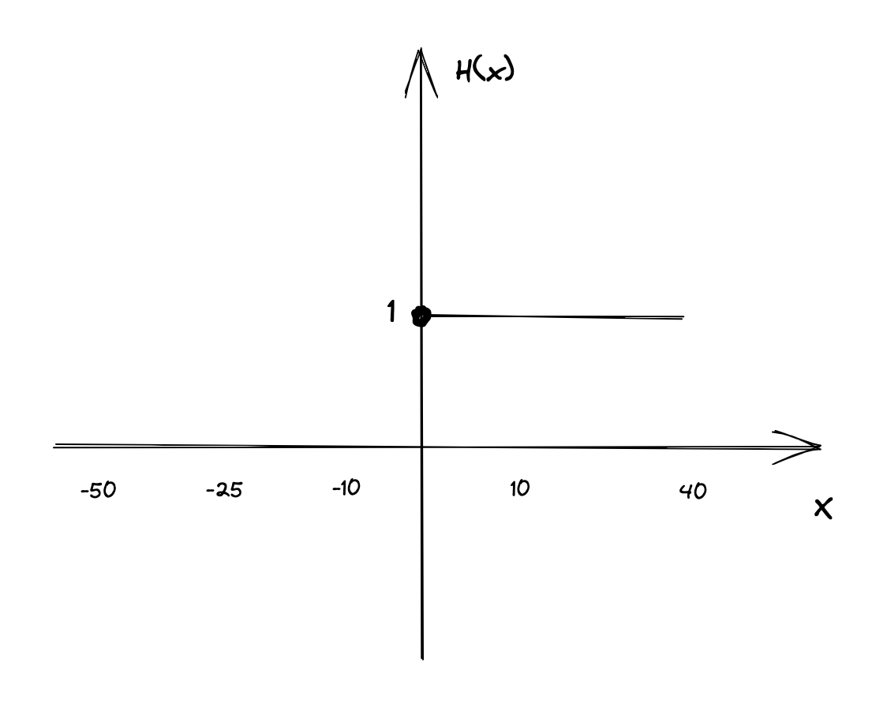
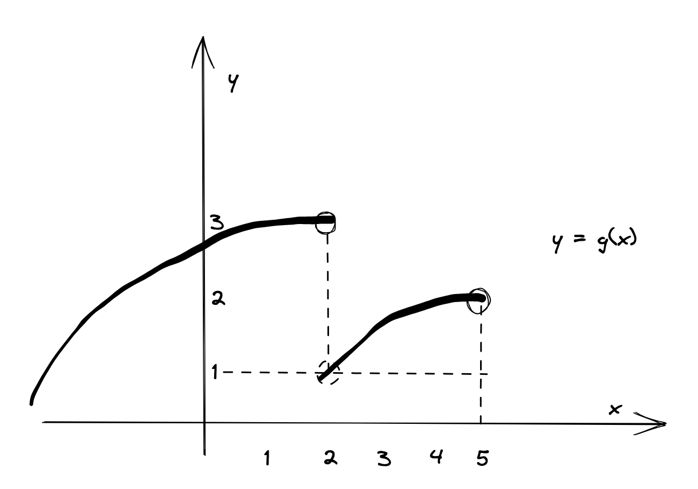

# Aula 1 - 27/02/2023

## Introdução

### Objetivo

- Motivação do curso de cálculo I
- Introduzir limit de função
- Apresentar o teorema de existência de limites

Contatos do professor:

- Email: joao.gomes@ucsal.com.br
- Celular: (71) 9 9941-6048

[Documento sobre o curso](https://docs.google.com/document/d/1BJHVHz-JLhQ5Os7XgETCd3IREE76GXdH2i0g9a2s6WU/edit)

### Conteúdo

- Limites, continuidade
- Cálculo de limites
- Derivadas, calculo de derivadas
- Introdução a integrais

### Avaliações

- Teste: 3,0
- Atividades: 2,0
- Prova final: 5,0

> Comentário - Se você não entende os calculos você deveria tentar resolver mais questões, sempre tentar fazer o dobro do que vê em sala de aula em casa.

### Referências

- James Stewart, cálculo volume 1
- Guidorizzi, Um curso de cálculo vol 1
- Diva Fleming, Cálculo A

## Motivação

- Hotel de Hilbert
- Cidade circular

### Cidade circular

Imagine que você mora em uma cidade que é um circulo e você mora no meio dela, essa cidade tem uma propriedade pra qualquer lugar que você ande tudo encolhe, inclusive você. Numa razão de 1/2

Existe um observador fora dessa cidade que entra em contato e fala que se você der 1000 passos você caminha para fora da cidade

Mas por mais que você ande você chega próximo a 1 mas não chega a 1

{ 0 - 0,1 - 1/2 - 3/4 - 7/8 .... }

A cidade é infinita.

### Hotel de Hilbert

Propõe um paradoxo interessante sobre infinitos.

Suponha que você tenha um hotel que tenha infinitos quartos. E que você tenha um número infinito de hóspedes. E que cada hóspede ocupe um quarto. E que cada hóspede ocupe um quarto diferente.

Chegou uma pessoa e perguntou por um quarto, o gerente moveu o hóspede do quarto 1 para o 2 e assim sucessivamente até o último quarto, e colocou a pessoa no quarto 1.

1 - Chega uma pessoa
$
{n \to n+1}
$

2 - Chega duas pessoas
$
{n \to n+2}
$

3 - Chega três pessoas
$
{n \to n+3}
$

K Pessoas: ${n \to n+k}$

4 - Chegaram $+\infty$
Pessoas

$card(in) = +\infty$

$2n \to +\infty$

$2n+ 1 \to +\infty$

## Limite de uma função

Considere a função $f(x) = x^2-x+2$

Queremos estudar o comportamento de $f(x)$ no ponto $x=2$

Tabela $x < 2$
| x | $f(x) = x^2-x+2$ |
| ----- | ---------------- |
| 1 | 2 |
| 1,5 | 2,75 |
| 1,8 | 3,44 |
| 1,9 | 3,71 |
| 1,99 | 3,9601 |
| 1,999 | 3,996001 |

> Quando voce olha pra uma tabela dessa voce conjectura que quando x se aproxima de dois f(x) se aproxima de 4

Tabela $x > 2$

| x    | $f(x) = x^2-x+2$ |
| ---- | ---------------- |
| 3    | 8                |
| 2,5  | 5,75             |
| 2,1  | 4,41             |
| 2,01 | 4,0401           |

> Quando voce olha para a tabela de $x>2$ voce conjectura que quando x se aproxima de dois f(x) se aproxima de 4

Logo quando x se aproxima de 2 f(x) se aproxima de 4

${\boxed{\large \lim_{x \to 2} xˆ2 -x + 2 = 4}}$

Limite da função quando x se aproxima de $x=2$

> A proposta do curso é aproximar e não chegar

### Definição

Suponha que $f(x)$ seja definido quando está próximo ao número $a$. (Isso significa que $f$ é definido em algum intervalo aberto que contenha $a$, exceto possivelmente no próprio $a$.) Então escrevemos$

$\lim_{x \to a} f(x) = L$

se pudermos tornar os valores de $f(x)$ arbitrariamente próximos de L (tão próximos de $L$ quanto quisermos), tornando $x$ suficientemente próximo de a (por ambos os lados de $a$), mas não igual a $a$.

### Exemplos

1 - Estime o valor do limite:

$$\lim_{x \to 1} \frac{x-1}{xˆ2-1}$$

$$\lim_{x \to 1} \frac{x-1}{xˆ2-1} = \frac{1-1}{1-1} = \frac{0}{0}$$

Indeterminação

> Mas isso não importa (indeterminação) devemos considerar os valores de $x$ que estão próximos de $a$, mas não são iguais a a.

Vizinhança de $x\to1$

$$x < 1$$

| x     | $f(x)$   |
| ----- | -------- |
| 0     | 1        |
| 0,5   | 0,666667 |
| 0,9   | 0,52     |
| 0,99  | 0,502513 |
| 0,999 | 0,500250 |

$$x > 1$$

| x    | $f(x)$        |
| ---- | ------------- |
| 2    | $\frac{1}{3}$ |
| 1,5  | 0,4           |
| 1,1  | 0,47          |
| 1,01 | 0,49          |

Com isso podemos conjecturar que x se aproxima de 0,5

2 - Estime o valor do limite:

$$\large\lim_{t \to 0} \frac{\sqrt{tˆ2+9} -3}{tˆ2}$$

Vizinhança - Tabela de $t$

| t        | $\frac{\sqrt{tˆ2+9} -3}{tˆ2}$ |
| -------- | ----------------------------- |
| $±1$     | $\sqrt{10}-3 = 0,1622$        |
| $±0,5$   | 0,1653                        |
| $±0,1$   | 0,16662                       |
| $±0,01$  | 0,166667                      |
| $±0,001$ | 0,166666                      |

3 - Estime:

$$\lim_{x \to 0} \frac{sen(x)}{x}$$

4 - A função de Heviside é definida por:

$$H(x) = \begin{cases} 0 & x < 0 \\ 1 & x \geq 0 \end{cases}$$

O que acontece quando $x \to 0$?

Grafico com h(x) sendo o eixo y e x sendo o eixo x

$$\lim_{x \to 0} H(x) = \lim_{x \to 0} \begin{cases} 0 & x < 0 \\ 1 & x \geq 0 \end{cases}$$

Vizinhos de $x \to 0$

$$x < 0$$

| x      | $H(x)$ |
| ------ | ------ |
| -1     | 0      |
| -0,5   | 0      |
| -0,1   | 0      |
| -0,01  | 0      |
| -0,001 | 0      |

$$x > 0$$

| x     | $H(x)$ |
| ----- | ------ |
| 0,001 | 1      |
| 0,01  | 1      |
| 0,1   | 1      |
| 0,5   | 1      |
| 1     | 1      |

Então temos $t \to 0ˆ+$ & $t \to 0ˆ-$

$$
\large
\begin{rcases}
\lim_{x \to 0} H(x) = 1 \atop lim_{x \to 0} H(x) = 0
\end{rcases}
⇒ \lim_{x \to 0} H(x)
$$

#### Definição

Escrevemos

$$\lim_{x \to aˆ-} f(x) = L$$

e dizemos que o limite à esquerda (ou direita) de $f(x)$ quando $x$ teste a $a$ é igual a $L$. Se podermos tornar os valores de $f(x)$ arbitrariamente próximos de $L$, para suficientemente próximo de $a$ e $x$ menor que $a-$ (ou a+)

$$
\lim_{x \to aˆ+} f(x) = L
$$

Análogo anterior.

5 - Considere o gráfico abaixo:

> Já caiu em um teste essa função

Determine:

- a) $\lim_{x \to 2} g(x)$
- b) $\lim_{x \to 2ˆ+} g(x)$
- c) $\lim_{x \to 5} g(x)$
- d) $g(5)$
